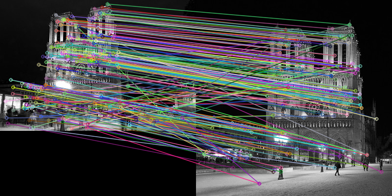
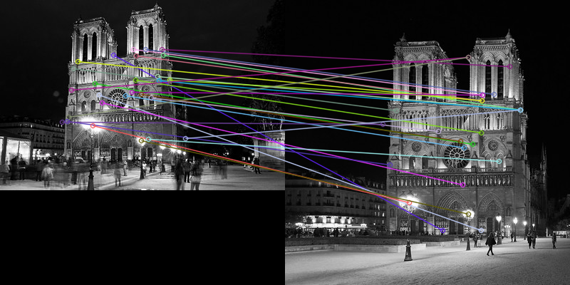
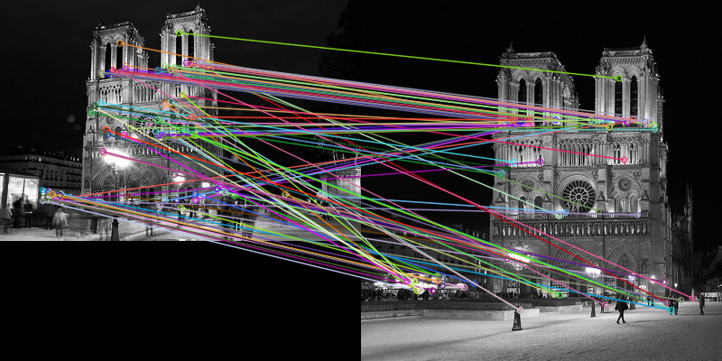

# image_matching
Implementing image matching using SIFT, BRIEF, and ORB
## Requirements
- Docker
## Usage
### SIFT
Confirm the following codes in Dockerfile
```
ADD sift.py .
RUN pip install opencv-python
```
Run the following commands
```
docker build -t sift ./
docker run -v ${PWD}:/code sift
```

### BRIEF
Confirm the following codes in Dockerfile
```
ADD brief.py .
RUN pip install opencv-contrib-python
```
Run the following commands
```
docker build -t brief ./
docker run -v ${PWD}:/code brief
```

### ORB
Confirm the following codes in Dockerfile
```
ADD orb.py .
RUN pip install opencv-python
```
Run the following commands
```
docker build -t orb ./
docker run -v ${PWD}:/code orb
```

## Results
### SIFT

### BRIEF

### ORB

